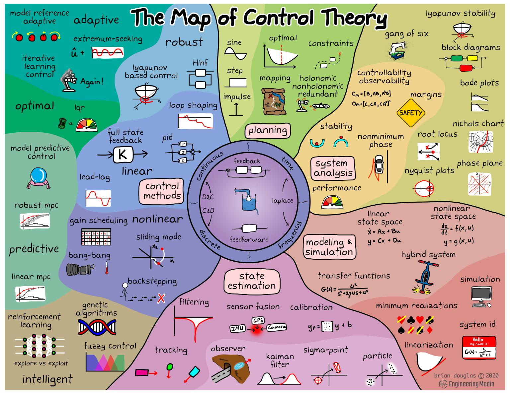

# CAG MAP

> computer aided governance map and process

## What is CAG MAP?

CAG Map is inspired by Brian Douglas's Map of Control Theory (pictured above). CAG Map is currently at first draft stage. The goal is to outline the motivation, process, concepts, and some tools for computer *aided* governance. 

The map is split into sections that describe the process of looking at data, asking questions, exploring solutions, presenting ideas, debating their validity, taking action, and observing results. This is inspired by the scientific process, but also quite different. The aim here is to persuade stakeholders to take action to solve a problem. As such computer *aided* governance is a political process.

## Why is a CAG MAP important?

We live in an increasingly complex world. Computers can help us process and work with complex data. More and more systems are running more and more important things, and humans need to steer these systems productively. Often humans need to design and manage these systems as a group. Computer *aided* governance explores how groups of humans can use computers to understand and steer complex systems.

This blog post (and accompanying map) provide an overview to the computer *aided* governance process. The goal is to provide intuition. It's not a comprehensive guide or formal process. Take what seems useful and discard the rest.

It should be noted that while the computer *aided* governance process aims to support productive and intelligent governance, it alone is not enough. If a system has an overly complex (or non-existent) governance process, or if power is distributed unevenly and some stakeholders are disenfranchised, this process will not work. If there is a solid foundation provided by a system with accurate and accessible data, clear rules and processes, empowered stakeholders, and aligned incentives then it might work. CAG is a small piece in a large puzzle.

