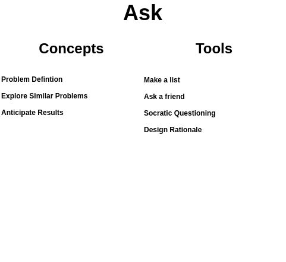

# Ask

> Picture of the Ask section (with pictures and colors) goes here. This can prime the reader for the next section and might also help to break up an otherwise monotonous wall of text.

## Overview

As you start to understand a system it's likely that you'll have some questions. Often these questions are answered as we learn more. Sometimes, however, there isn't an obvious answer. If so, the next step is to clearly define the question. Then if there is an answer people can help you find it, but if there isn't you can explore potential solutions and maybe even create a proposal to implement a change.

There are a lot of resources out there to help us [ask better questions](https://en.wikipedia.org/wiki/Socratic_questioning) and [solve problems](https://en.wikipedia.org/wiki/How_to_Solve_It). In this section we'll use the words "question" and "problem" interchangeably. It's recommended that you explore resources for both because solving the right problems starts with asking the right questions.

## Concepts

### Problem Definition

Defining the question you want to ask or the problem you want to solve is one of the most important steps. If you don't know what problem you're solving how will you know when you've found a solution? Also, if people don't know what problem you're trying to solve they won't be able to work with you and help you find solutions. 

- Can you state the problem in a single sentence?
- How will you know when the problem is solved?
- What are the constraints for any potential solutions?

### Explore Similar Problems

History doesn't repeat, but it does rhyme. It's likely that someone somewhere has had to deal with a similar problem as the one you're exploring. It might be that the dynamics of the problem are similar, but it's applied in a different context. It might also be that the context is similar, but there was a slightly different problem. Regardless, building off of prior work can often save you a lot of time and energy.

- Can you find any problems similar to the one you're trying to solve?
- If so, could a solution to that problem be applied to your problem (potentially with modifications)? 

### Anticipate Results

The point of running experiments is to validate results. There's an infinite amount of things we *could* do, but forming a hypothesis allows us to test things that seem the most *probable*. The hypothesis has to come before the experiment, otherwise you haven't proven anything other than your ability to cherry pick data and/or get lucky. By formulating a detailed hypothesis you'll have a better idea of what's working or what's not, and more importantly why not. 

- What do you expect to happen if you do nothing? 
- What do you expect to happen if you implement a solution?

## Tools

### Make a list

Just writing out your ideas can help you start to understand and organize them better.

You can even plot ideas on a spreadsheet and then rank them according to their attributes and trade-offs. The exercise of defining attributes can often help you better understand the problem and potential solutions, even if there isn't a clear solution yet.

In the initial stages (after brainstorming) a simple way to triage ideas is to first eliminate ideas as rationally as possible based on their characteristics. Then, once you've curated via logic use emotions to choose between the best options left. This way you eliminate choices that you might be biased towards, but can also move forward to choose a solution if there's no obvious way to discern between options.

### Ask a friend

Getting feedback, esp from people with different viewpoints than your own, can help you better understand the problem you're trying to solve as well as where there might be gaps in your own thinking.

### Socratic Questioning

[Socratic Questioning](https://en.wikipedia.org/wiki/Socratic_questioning) is a process of evaluation that can help you explore alternative perspectives to understand a problem. This looks something like:

- Explaining your thought process to clarify your thinking.
- Look for (and challenging) assumptions in your problem definition or solution.
- Providing evidence to validate those assumptions.
- Asking what you might think if you were arguing against the idea.
- Explore the first and second order effects of the solution, and new problems that might arise as a result.
- Question the original question to determine if it's even the right problem to be solving to create the change you want.

### Design Rationale

A [design rationale](https://en.wikipedia.org/wiki/Design_rationale) explains the decisions made during a design process, and the reasons why those decisions were made. Its primary goal is to support designers by providing a means to record and communicate the argumentation and reasoning behind the design process. This often involves the questions you asked, the solutions considered, and why your proposed solution seems like the best choice. 

- the reasons behind a design decision
- the justification for it
- the other alternatives considered
- the trade offs evaluated, an
- the argumentation that led to the decision

