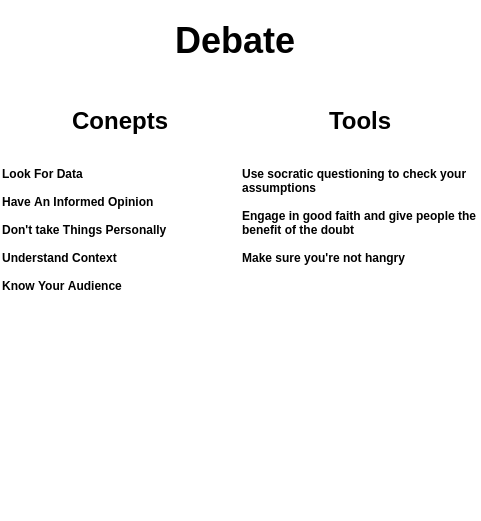

# Debate

> Picture of the Debate section (with pictures and colors) goes here. This can prime the reader for the next section and might also help to break up an otherwise monotonous wall of text.

## Overview

Any idea can seem good in our heads. We don't really get to test them out and improve them until we bring them into the real world. The first step in this process is debate. Sharing ideas and defending and/or updating them based on feedback and critique.

Good debates involve critical thinking. This means that people will be critical. This is OK, good even, as long as we're critical on ideas and not people. This way we can improve our ideas and arrive at better outcomes for all parties involved.

Politics is how we adjudicate ideas and preferences between stakeholders. A healthy political process allows people to battle over ideas. An unhealthy political process is when ideas are used to battle people. The former leads to productivity, while the later leads to corruption. If you find yourself looking for data or ideas to battle people, take a step back. Computer *aided* governance requires a data driven decision making process. If your emotions are in the drivers seat you're not doing it right.

---

Many social systems aim to represent the interests of a group of people as a whole. Social systems, however, cannot think or act. Political actors within a social system can. The constitutional rules of a social system determine how political actors can represent their interests and adjudicate disagreements. The system itself cannot have an opinion on these interests or the outcomes of adjudication. The system is a process, not a conscious entity. Opinions are the domain of political actors. It is then their responsibility represent their interests by engaging in the political process.

Many social systems allow individuals to take political action, but individuals as a whole are a diverse group. They have many different opinions, interests, and incentives. There is no single voice that represents them all. There are, however, many smaller groups within the system who have more concentrated opinions and incentives. These minority groups are often impacted by, and thus care a lot about, a few specific things. The majority is less impacted by those things, and rationally, they choose to remain less informed of them (rational ignorance). The cost of becoming informed outweighs potential benefits. There's only so much time in the day. For concentrated minority groups, however, the benefits of becoming informed, coordinating, and acting to represent their interests is very high. Naturally, these minority groups are the most politically active.

The system aims to represent the interests of the majority of individuals, but most individuals don't care about most things. Those who do care are often concentrated minorities who care about specific things. They are the most likely to engage in the political process to have their opinions represented. The system then represents the interests of coordinated minority groups rather than the majority of individuals as a whole.

The only way around this is for everyone to have skin in the game and participate in governance. Otherwise, when minority groups push the system to a local optima that favors them, no one will push back. Someone has to actually care about the opposite side of a policy otherwise power is just balanced in theory.

---

## Concepts

### Goodwill

In the early days there's often a lot of goodwill among a community/project. This is great, but it doesn't scale. Thinking that just because you don't have governance problems now means you can kick the can down the road is incorrect. Once you have a governance problem it's too late to create a formal decision making process. This is because whoever designs the decision making process sets the defaults. Defaults are powerful. If you do this while everyone's getting along it's more likely that these defaults will represent the interests of the group. If it's done in the heat of a political battle the defaults will favor whoever wins that battle. This will set any remaining goodwill to zero. Don't do this. Preserve goodwill by setting a governance system early on.

### Look For Data

Is the motivation and rationale for a proposal backed by data? If not, can you find any data that supports or refutes a proposal?

### Informed Opinions

Think about and internalize questions enough to be able to argue for and against competing viewpoints. This can help greatly speed up debates by reducing time wasted on obvious answers. It can also make things more productive as the ideas that are surfaced are likely to be more interesting and insightful if some real thought is put into them.

#### Confirmation bias

> [Confirmation bias](https://en.wikipedia.org/wiki/Confirmation_bias) is the tendency to search for, interpret, favor, and recall information in a way that confirms or supports one's prior beliefs or values. People display this bias when they select information that supports their views, ignoring contrary information, or when they interpret ambiguous evidence as supporting their existing attitudes. *The effect is strongest for desired outcomes, for emotionally charged issues, and for deeply entrenched beliefs.* Confirmation bias cannot be eliminated entirely, but it can be managed, for example, by education and training in critical thinking skills.

If we all agreed on everything all the time collective decision making processes would not be needed. When we disagree, but want to come to consensus to collectively move forward together, then we need governance. The problem is that the more we care about a decision the more we have *desired outcomes, emotionally charged issues, and deeply entrenched beliefs.* So when we're drafting or analyzing governance proposals we're likely to be exhibing confirmation bias, which defeats the purpose of data driven communication and debate to begin with.

### The power of defaults

Something about how defaults have gravity and it takes a certain amount of energy to break out of that local optima and into a new thing.

### Don't Take Things Personally.

Or at least try not to. This is easier said than done. Once you've mastered this you've mastered life.

### Sacred vs Profane

Sacred governance doesn't work
You need one foot in the gutter (practice) and one foot on the sidewalk (theory) to really understand it

### Formal and informal fallacies

https://en.wikipedia.org/wiki/Fallacy

Fallacious arguements (often formally valid, but informally fallacious)

### Getting people to vote

Code programs machines.
Media programs humans.

### Understand Context

Think about the broader context of the discussion to ensure that the full picture is brought into view, not just a curated slice that supports a particular narrative.

https://www.lesswrong.com/posts/Kbm6QnJv9dgWsPHQP/schelling-fences-on-slippery-slopes

- There is an inherent tradeoff between optionality on the side of those taking actions and certainty on the side of those receiving the consequences of the actions; Schelling fences are an attempt to support the latter. So to me Schelling fences are not about blocking participation, they’re about protecting non-participants (and minorities).

### Know Your Audience

Most people don't comment, but they might read and vote. In responses to comments you're speaking to the broader community as well as the direct recipient of question/response.

### Global vs Local

**Governance is globally positive-sum, but locally zero-sum.**

At the global level governance is positive-sum. It allows us to:

- achieve more than we could individually and/or avoid ruinous outcomes (coordination and CPRs)
- adapt over time so that processes and decisions remain relevant and the system as a whole can improve (anti-fragility and evolution)

At the local level governnace is zero-sum. It allows us to:

- represent our interests and compete for power through the political process (competative markets)
- adjudicate competing interests between competing actors so that consensus can be reached even if actors disagree (consensus - agreeing on processes even if you disagree on outcomes) 

More competition leads to more innovation and effeciency, but subsidiarity limits the power that subsidiaries can have within the system.

## Tools

### Use Socratic questioning to check your assumptions.

[Socratic Questioning](https://fs.blog/2018/04/first-principles/) can help you get a fresh perspective when you're getting too emotional or are just stuck in a rut.

- Clarifying your thinking and explaining the origins of your ideas (Why do I think this? What exactly do I think?)
- Challenging assumptions (How do I know this is true? What if I thought the opposite?)
- Looking for evidence (How can I back this up? What are the sources?)
- Considering alternative perspectives (What might others think? How do I know I am correct?)
- Examining consequences and implications (What if I am wrong? What are the consequences if I am?)
- Questioning the original questions (Why did I think that? Was I correct? What conclusions can I draw from the reasoning process?)

### Clarify assumptions even more

People confuse facts with opinions, cultural norms with laws, assumptions with agreements. This is 50% of all conflicts. The other 50% is incentives.

If people do present opinions, ask them to back them up with facts. Ask why they think that, how they came to that conclusion, and what evidence they're building their hypothosis on. Either you'll learn something or they will. 

### Engage in good faith and give people the benefit of the doubt.

What would your response be if you thought they were the smartest person in the world?

What would your response be if you they were your best friend?

Are either of these responses potentially better than your current thinking?

https://medium.com/@Vlad_Zamfir/how-to-participate-in-blockchain-governance-in-good-faith-and-with-good-manners-bd4e16846434

### Make sure you're not hangry.

Really simple. Eat a snack. Take a nap. Try again in a few hours.

